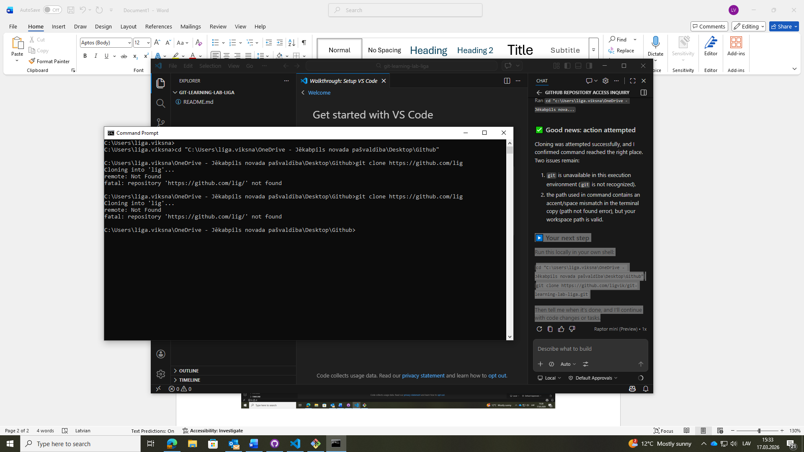

# git-learning-lab-liga

This repository is a personal learning lab for Git and GitHub workflow practice.

## 🚀 Quick start

1. Clone:
   ```bash
   git clone https://github.com/ligvik/git-learning-lab-liga.git
   ```
2. Enter folder:
   ```bash
   cd git-learning-lab-liga
   ```
3. Inspect files:
   ```bash
   ls -la
   ```

## 🧩 Purpose

- Hands-on exercises for branching, commits, merging, and collaboration.
- Backup playground for learning git commands and best practices.

## 📌 Notes

- If you want specific tasks (e.g., add feature branch, resolve merge conflict), just ask and I can suggest exact commands.


